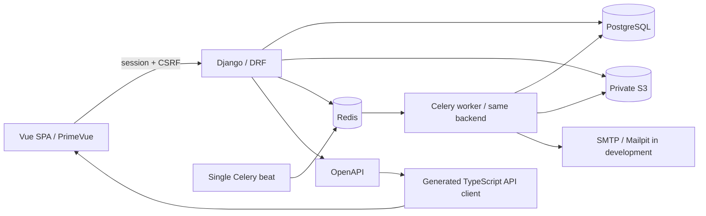

# Архитектура

## Решение

Модульный монолит Django. Один PostgreSQL, приватный S3, Redis для очереди и throttling. Celery worker использует те же модели и сервисы, но запускается отдельным процессом. Один beat очищает истёкшие приглашения каждые пять минут. Vue SPA обслуживается отдельно; OpenAPI — контракт, генерируемый из DRF, а не независимая вручную поддерживаемая схема.

## Границы

| Модуль       | Ответственность                                                       | Зависит от                                            |
| ------------ | --------------------------------------------------------------------- | ----------------------------------------------------- |
| accounts     | единый пользователь, session login, подтверждение смены почты         | common                                                |
| institutions | учреждения, годовые классы, назначения сотрудников, история членства  | accounts, common                                      |
| courses      | курсы и индивидуальные записи                                         | institutions, accounts                                |
| projects     | команды, этапы задания, отправка и учебная оценка                     | institutions, accounts, crm                           |
| documents    | метаданные, история файлов, восстановление, текстовый diff            | projects, accounts, crm, S3                           |
| integrations | независимые адаптеры провайдеров, PR и учебная проверка               | projects, accounts                                    |
| publications | публичные материалы, конкурсы, технические темы, production seed      | common                                                |
| invitations  | будущие учащиеся, одноразовые приглашения, импорт и приватный экспорт | accounts, institutions, common                        |
| scheduling   | занятия, недельные серии, отдельные исключения, посещаемость          | institutions, accounts, common                        |
| workshops    | вузы/школы-партнёры, мастер-классы, записи и очередь                  | institutions, accounts, common                        |
| crm          | фактические учебные действия, агрегаты в разрешённой области          | courses, projects, scheduling, invitations, workshops |
| common       | UUID, audit, уведомления, права доступа, API errors, seed receipts    | accounts/institutions как строковые FK                |

Пользователи и учреждения общие. Университет — тип Institution, не отдельная таблица аккаунтов. StaffAssignment допускает несколько ролей одного пользователя в одном или нескольких учреждениях. TeachingAssignment ограничивает преподавателя конкретными классами. StudentMembership сохраняется после завершения обучения; новый учебный год — новый Classroom.

Сервисы содержат транзакционные операции; ViewSet не выдаёт неотфильтрованный queryset. Сервер проверяет права также при создании, когда ещё нет объекта для object-level permissions. Предоставляемый браузером UUID никогда не означает разрешение доступа. Admin ограничен superuser; institution admin не получает глобальный Django Admin.

## Существенные решения

- Session auth выбран вместо хранения bearer-токенов в localStorage. Собственные домены одного site обязательны для устойчивых cookies между Vercel и Railway. CSRF токен возвращается session endpoint и передаётся в header; CORS разрешает конкретный frontend origin с credentials.
- Файлы не попадают в PostgreSQL. UUID object keys, SHA-256, автор, размер и предыдущая версия хранятся в БД. Через API нельзя менять существующую версию; восстановление — новый файл и новая строка. Извлечение текста является изменяемым производным кэшем, не частью оригинала.
- S3 bucket приватный; скачивание идёт через авторизованный API. Клиент не получает прямой постоянный URL объекта. В production FileSystemStorage исключён обязательным S3 configuration.
- DOCX/PPTX: извлекается текстовая структура таблиц/параграфов/слайдов; оформление и изображения не сравниваются. Это явно указано в API и UI.
- Outbox сохраняется в транзакции бизнес-операции. on_commit ускоряет dispatch; beat восстанавливает задания при отказе брокера. Lease/retry/backoff и unique event key ограничивают повторы. SMTP остаётся at-least-once.
- Расписание первой версии материализует 1–52 недельных события в timezone серии. Отдельные изменения — исключения; массовое изменение формат/ссылка/статус исключения не трогает. Массовый перенос сдвигает локальные даты/время серии, сохраняет исключения и проверяет весь набор перед записью.
- Последние места мастер-класса защищены блокировкой Workshop в PostgreSQL; единство individual/group обеспечено unique(workshop,user). Waiting продвигается при отмене подтверждённой записи.
- GitVerse имеет собственный HTTP-адаптер и webhook authorization header, GitHub — HMAC. Контракты проверены MockTransport; реальные accounts/tokens не настраивались. Inbox/outbox синхронизирует PR, учебная проверка привязана к SHA. См. integrations.md.
- Production seed — отдельный протокол с закрытым allowlist; не dumpdata и не автоматический startup hook.

## Переиспользование логики

- `common/access.py`: выбор действующих преподавателей класса используется уведомлениями курсов/проектов и проверкой назначения в расписании.
- `common/reviews.py`: общий набор решений accepted/revision и обязательное замечание для доработки. Предусловия, права, блокировки, история и прогресс остаются в сервисах соответствующих модулей.
- `apps/web/src/api.ts`: общие заголовки CSRF/If-Match, запоминание ревизий и уведомление об истёкшей сессии для generated client и resource request.
- `useOperation` отвечает за состояние операции/ошибки, `useUnsavedChanges` — за уход со страницы. Неиспользуемый trackChanges удалён; синхронное отслеживание изменений форм сохранено у потребителей.
- `utils/dateTime.ts`: отображение дат и преобразование API timestamp для datetime-local в часовом поясе браузера. Правила часового пояса серий остаются на сервере.

Неиспользуемые страницы, иконки, компоненты, counter store и assets стартового шаблона create-vue удалены. Миграции, operational данные, development fixtures и production seed при чистке не меняются.

## Версии и воспроизводимость

Генератор create-vue 3.24.0; Django 6.1.1, DRF 3.18.1, Celery 5.6.3, drf-spectacular 0.30.0. Точные Python зависимости — requirements.lock, npm — package-lock.json. Node 24 и Python 3.14 в Docker; PostgreSQL 18 и Redis 8. SeaweedFS 4.48 выбран для локального S3 после фактической недоступности образов MinIO; [официальный quick start](https://github.com/seaweedfs/seaweedfs/wiki/Quick-Start-with-weed-mini) описывает команду mini, env credentials и создание bucket.

PrimeVue зафиксирован на стабильном MIT-релизе 4.5.5, themes 1.2.2. Проверенный latest PrimeVue 5.0.2 требует отдельной лицензии и показывал Invalid PrimeUI License; starter не предполагает, что у пользователя есть лицензия. Обновление на 5.x потребует отдельного решения и проверки совместимости/лицензирования. Источники: [PrimeVue v4](https://v4.primevue.org/), [актуальные лицензии PrimeUI](https://primeui.dev/licenses). Версии являются намеренным выбором совместимого работающего набора, а не обещанием автоматического обновления на latest.
