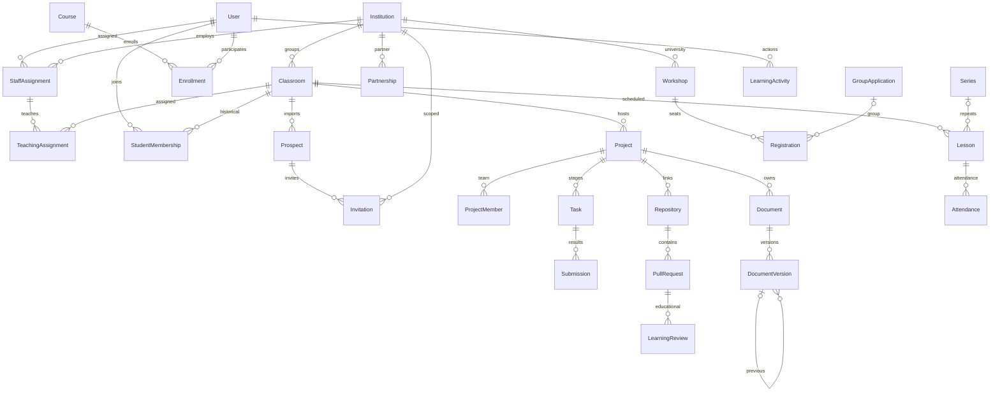

# Модель данных

Все рабочие доменные сущности имеют UUID и timestamps. User использует встроенный Django numeric PK, но он никогда не экспортируется в production seed. Topic имеет natural key code; Publication/Competition — slug.

## Ограничения и значения

- Institution.kind: school, college, university.
- Classroom unique(institution,name,academic_year). История перевода представляется окончанием старого StudentMembership и созданием нового. Предыдущие результаты ссылаются на старый класс; удаления истории через API нет. Автоматический мастер перевода ещё не реализован.
- StaffAssignment unique(user,institution,role), роли admin/curator/teacher/organizer; active выключает доступ. Platform administrator — is_superuser; глобальная роль teacher на User отсутствует.
- TeachingAssignment unique(staff,classroom). Один преподаватель имеет несколько назначений.
- StudentMembership unique(user,classroom), started_at и ended_at. ended_at закрывает текущий доступ по членству, не удаляет результаты.
- Enrollment unique(user,course), classroom связывает учёт с областью преподавателя. Отдельных lesson units курса и completion records пока нет.
- ProjectMember unique(project,user), role leader/member. Milestone — формальный этап с criteria/status/due_at; Task.milestone и criteria, старый stage сохраняет совместимость. Submission — draft/submitted/accepted/revision, previous/document_version/submitted_at; ReviewEvent — неизменяемое решение конкретной отправки, ProjectTransition — история состояния.
- DocumentVersion.previous/restored_from — явные связи. filename — отображение, file — приватный ключ S3, checksum SHA-256, size, author и created_at. Удаление/редактирование оригинала не предоставляется. Extraction status pending/done/failed.
- Repository требует approval платформы для серверного токена. PullRequest.status/head_sha/source_updated_at — состояние провайдера. LearningReview.revision/result/decided_at — отдельная проверка SHA, unique(PR, reviewer, revision). WebhookEvent — inbox unique(repo,delivery), SyncJob — результат sync.
- Invitation: email, role, institution, optional classroom/prospect, hash токена, временное Fernet encryption для повторного экспорта, pending/accepted/revoked/expired, expires_at. Код подтверждения хранится HMAC, попытки и срок ограничены. Invitation.accepted_by закрепляет аккаунт.
- ImportBatch: снимок rows/errors, actor, classroom, applied_at, expires_at. Подтверждение повторно проверяет конфликты и выполняется одной транзакцией.
- EmailChange: отдельный подтверждённый владельцем процесс с новым email, сроком и кодом; преподаватель не меняет User.email.
- Lesson: UTC starts_at/ends_at, IANA timezone, один Classroom и optional Course того же учреждения, teacher/curator, online/onsite, scheduled/rescheduled/cancelled/completed, URL или location/room. Series содержит timezone и начальную дату; повторения материализованы. Attendance unique(lesson,user).
- Partnership: university/school, active/pending/ended, starts_on/ends_on. Стороны не копируются из локальной базы в production.
- Workshop: возрастные границы и требования, ведущий organizer, формат, даты, registration window, capacity, audience all/partners/selected; selected schools — M2M. Для каталога требуется published.
- Registration unique(workshop,user), confirmed/waiting/cancelled, group nullable, attended. GroupApplication хранит responsible/school; список людей — связанный Registration, без двойного учёта.
- Subscription unique(user,school), email_enabled; доступность подписки ограничена сотрудниками школы.
- AuditEvent: actor/action/target/institution/details. Details выбираются сервером, никакого полного request body. Notification привязана к конкретному recipient. LearningActivity относится к конкретному классу.
- SeedReceipt: natural model:key -> fingerprint последнего импортированного содержимого; защищает ручные production-правки.

- Course.status, Assignment(criteria/due_at/required), Enrollment(status/classroom), CourseSubmission(previous/status/text), CourseReview OneToOne — обучение и история проверок. Прогресс рассчитывается по принятым обязательным заданиям.
- Publication/Competition visibility и derived status из published/archived. CompetitionApplication unique(competition,project), ApplicationTransition со снимком текста/названия проекта.
- User.display_name/date_of_birth, LoginEvent — история фактических входов, отдельно от LearningActivity.
- Comparison unique(old,new), status/result/error_code; DocumentVersion.structure — изменяемый производный кэш Office. Unique(previous) и один root на документ обеспечивают линейную цепочку.
- Notification event_key/kind/target/delivery_status/read_at, unique(event_key,recipient). Outbox unique(key), task/encrypted payload/status/attempts/available_at/lease/error type. Это operational данные, не seed.

Универсальные подгруппы занятий и расписание по курсу отдельно от класса ещё не реализованы. Миграции новых сущностей сохраняют существующие записи; никакой очистки пользовательской БД для удобства не выполняется.
