# Предварительная дизайн-система

Четыре ссылки pin.it не открылись инструментом просмотра. Исходные Pinterest-референсы не были изучены, поэтому визуальное соответствие им не заявляется. Скриншоты ниже показывают текущий интерфейс, а не исходные референсы; после получения самих референсов потребуется отдельно сравнить композицию, цвета, типографику и таблицы.

Сейчас выбран спокойный образовательный кабинет: светлая бумага #f6f7f2, белые панели, тёмный зелёный текст #243b30, действие #39794b, лаймовый акцент #e4edbf, тонкие разделители #e5e9df. Typography Manrope с Arial fallback; заголовки 34/27px, body 14px, подписи 10–12px. Основной radius 20px, panel padding 26/20px, grid gap 20px. Токены централизованы в src/assets/main.css; PrimeVue Aura preset переопределён под зелёную палитру. Стандартная default PrimeVue theme не оставлена.

Навигация desktop фиксированная, mobile выдвигается кнопкой. Карточки перестраиваются 3 -> 2 -> 1 колонку, формы укладываются в одну колонку, таблицы имеют независимый горизонтальный скролл, календарь прокручивается на маленьком экране. PageState — общий загрузчик, ошибка с повтором и пустое состояние. Данные приходят из API, демонстрационные цифры в UI не встроены.

Страницы: overview, login, invite proof, institutions/classes/courses/projects/publications/competitions, class import/export/correction, project assignments/submissions/review/documents/diff, calendar week/month/list, workshops individual/group signup, CRM filters. Разделы staff скрыты для учащегося; ошибки доступа всё равно обрабатываются сервером. Интерфейс организатора мастер-классов/партнёрств в этой итерации остаётся API/Admin. Прямые URL поддерживает Vue Router и Vercel SPA fallback.

Графика hero состоит из CSS-орбит и стрелки, чужие логотипы/брендовые материалы не использованы. Заголовок страницы и html lang настроены для русского языка. Состояния и действия обозначены label/aria-label; календарные и табличные поля ещё нуждаются в полном accessibility review.

## Скриншоты интерфейса

Снимки демонстрируют актуальные страницы и демонстрационные данные. Вход и регистрация показаны отдельно; остальные страницы сняты в авторизованном кабинете.

| Обзор и вход | Регистрация и класс |
| --- | --- |
| 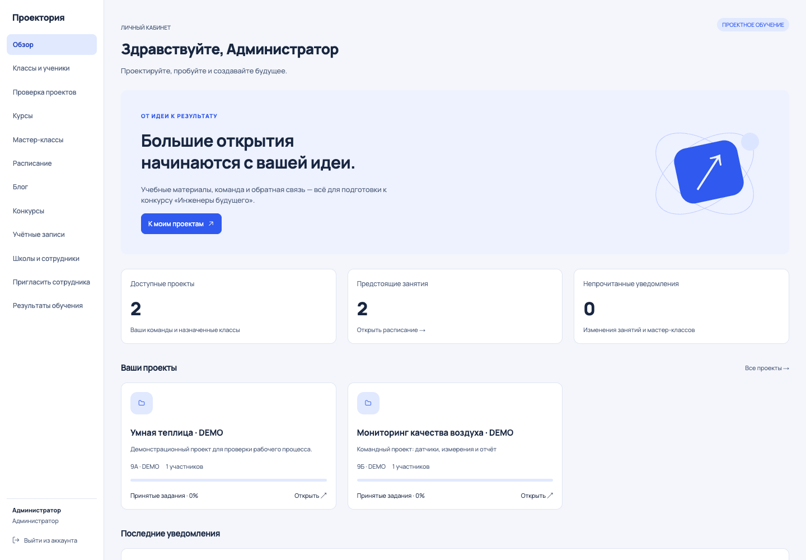 | 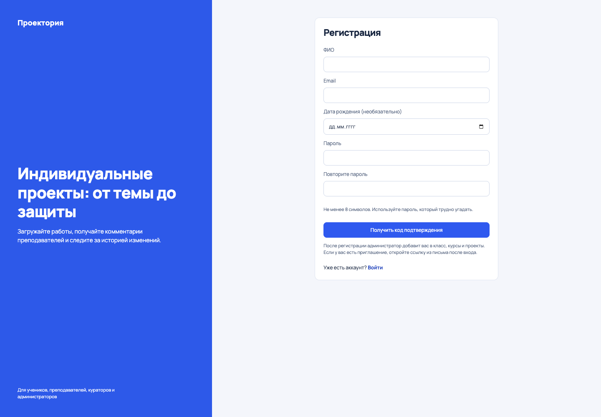 |
| 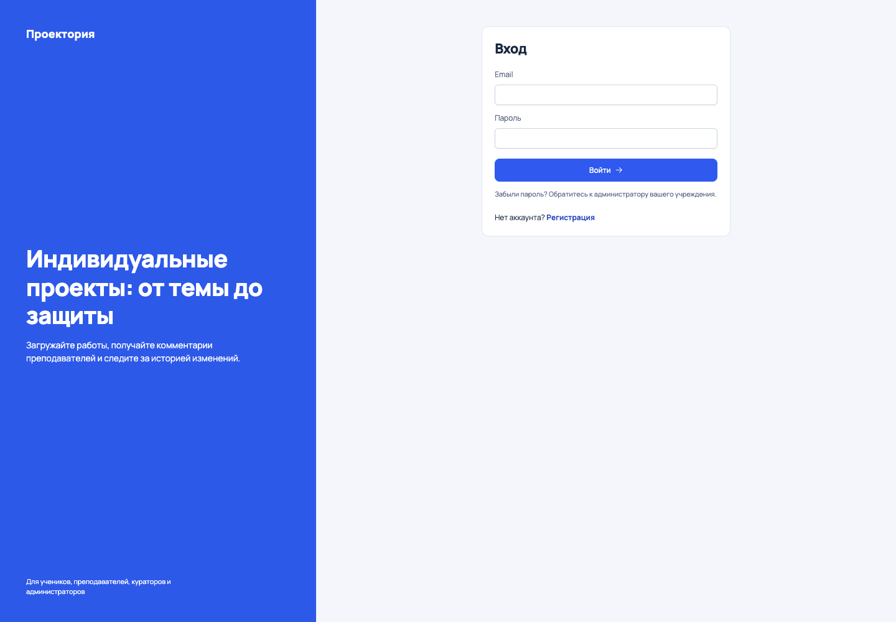 | 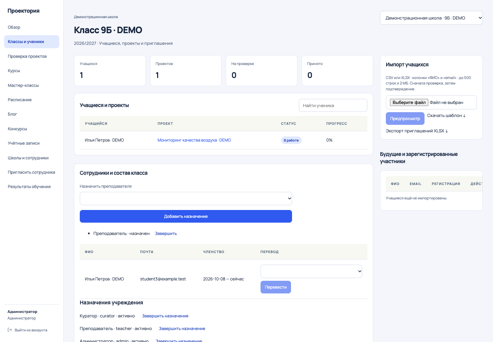 |

| Учреждения и учётные записи | Профиль пользователя и расписание |
| --- | --- |
| 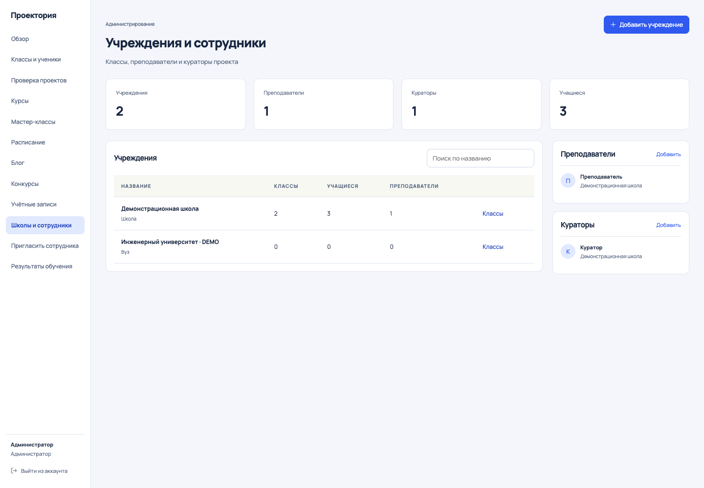 | 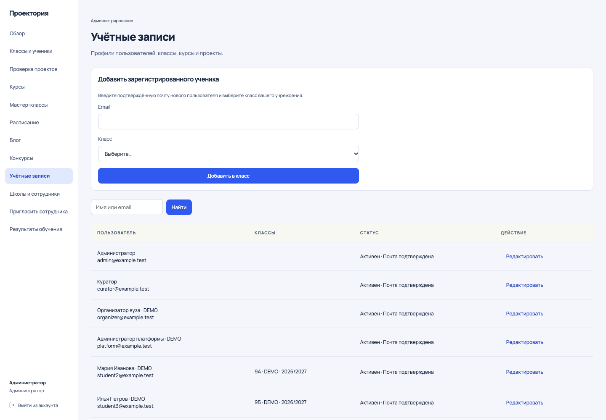 |
| 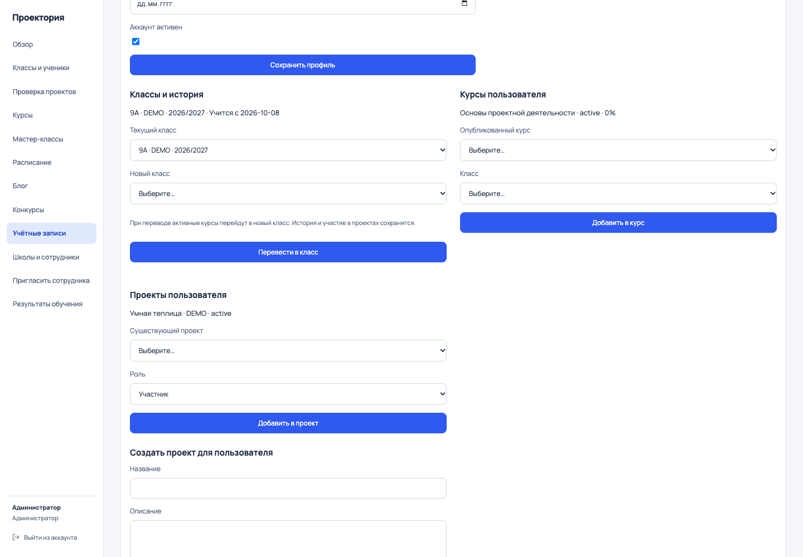 | 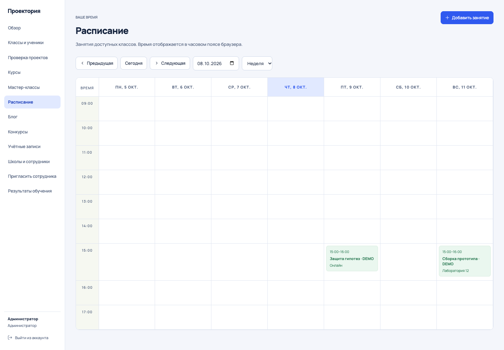 |

| Курс и проект | Блог и редактор статьи |
| --- | --- |
| 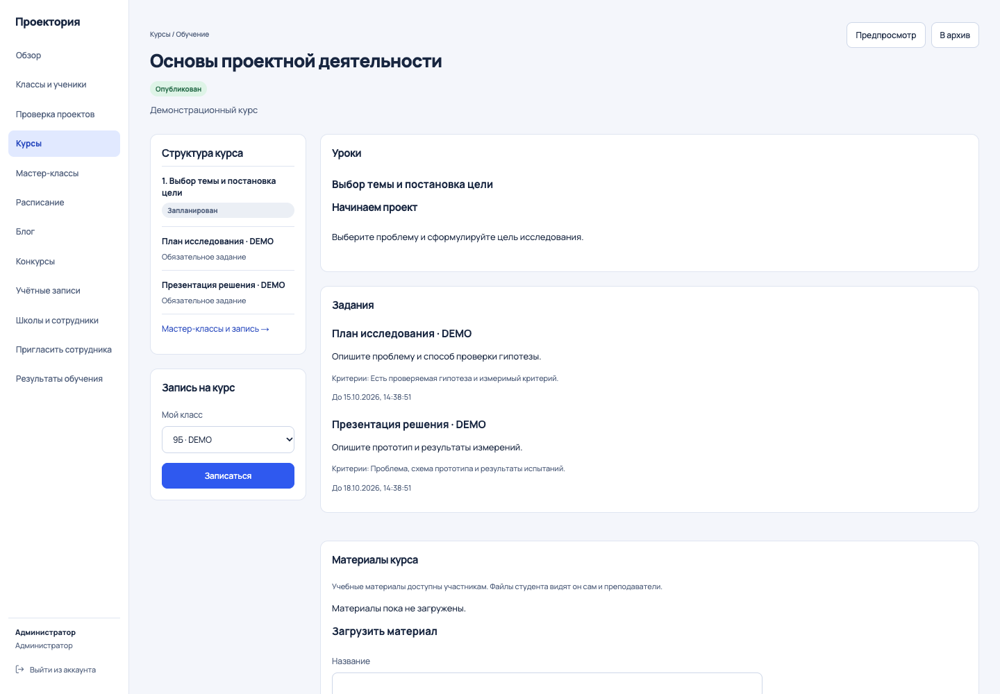 | 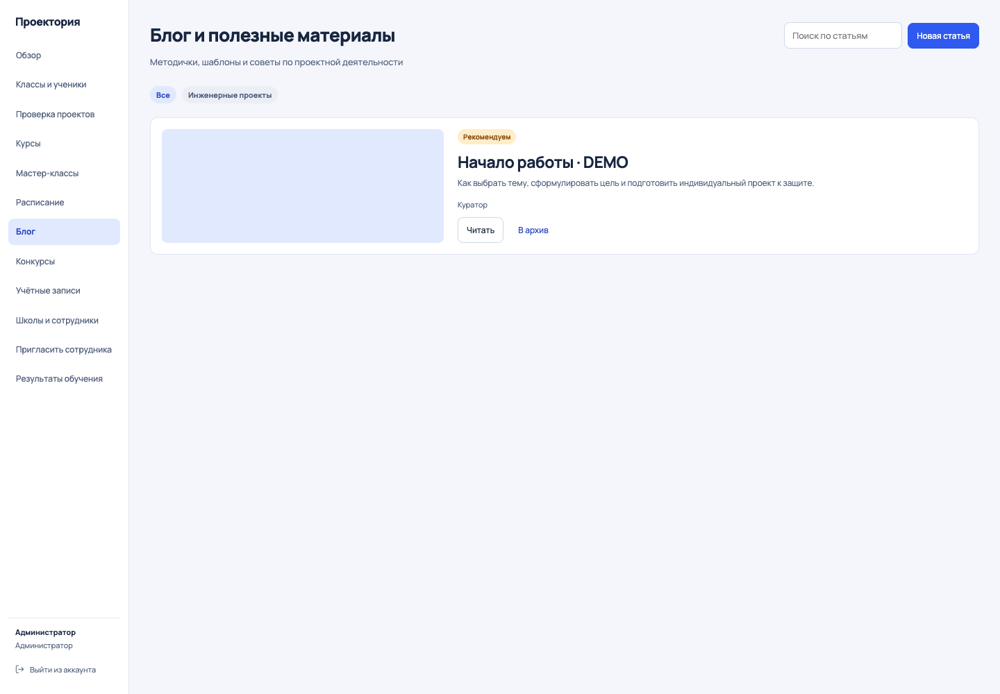 |
| 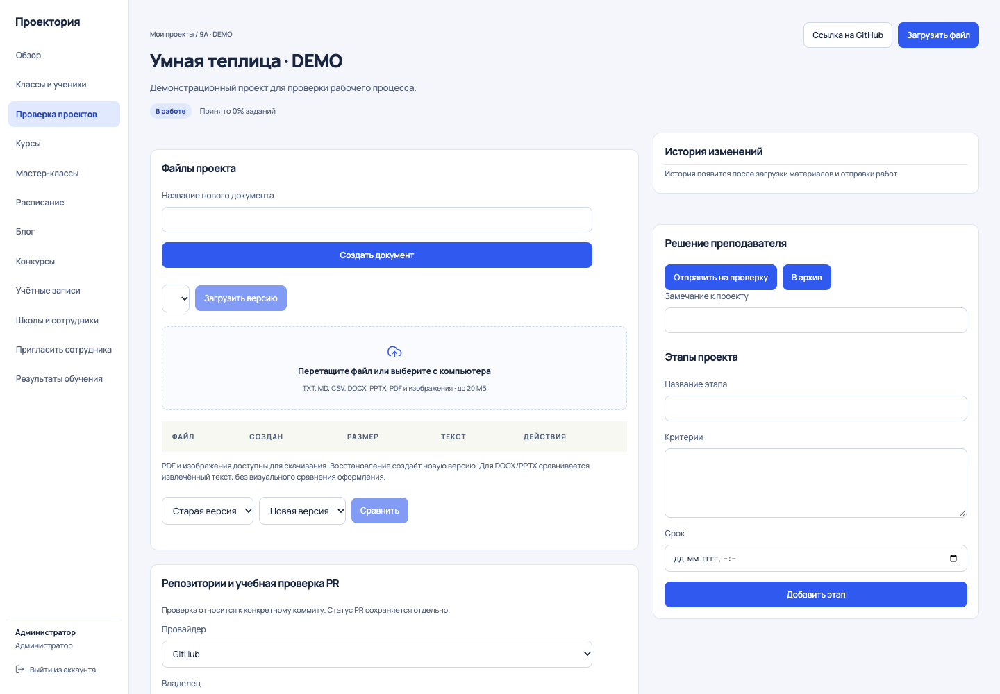 | 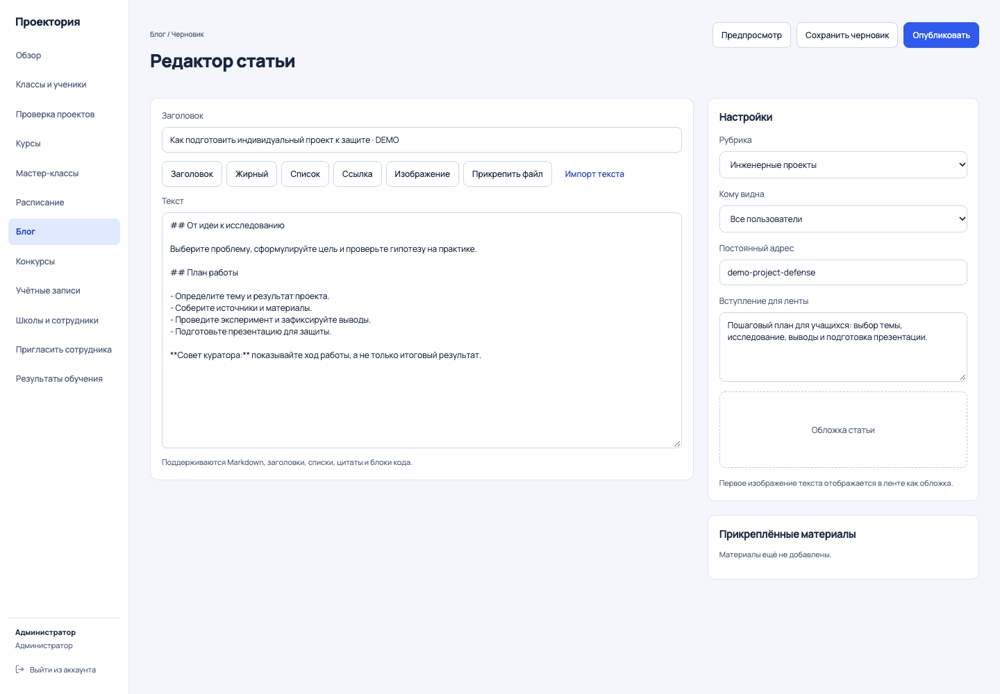 |

## Структура стилей

Точка входа — `apps/web/src/assets/main.css`: импорты, базовая типографика и глобальные правила элементов. Предметные стили находятся в `assets/styles/`:

- `settings/tokens.css` — переменные дизайн-системы.
- `layout/` — оболочка приложения, навигация, сетки и заголовки разделов.
- `components/` — карточки, формы, состояния, таблицы, календарь, diff и настройки PrimeVue.
- `pages/` — hero главной страницы и оформление авторизации.

Media queries располагаются в файлах соответствующих компонентов и компоновок; глобальный адаптивный размер h1 остаётся в main.css. Стили подключаются единожды через main.ts.
